# KdG MineralFlow - Logistics Management System

A modern, responsive web application for managing logistics operations in the mineral distribution industry. Built with
React, TypeScript, and Material-UI, this system provides comprehensive tools for warehouse management, truck scheduling,
purchase orders, and appointment scheduling.

# Application Screenshots

#### Dashboard
<p float="left">
  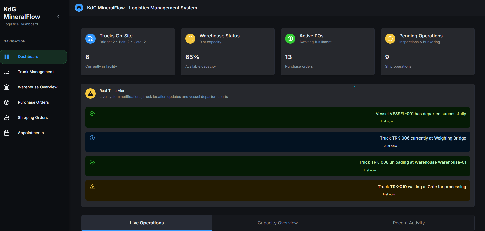
  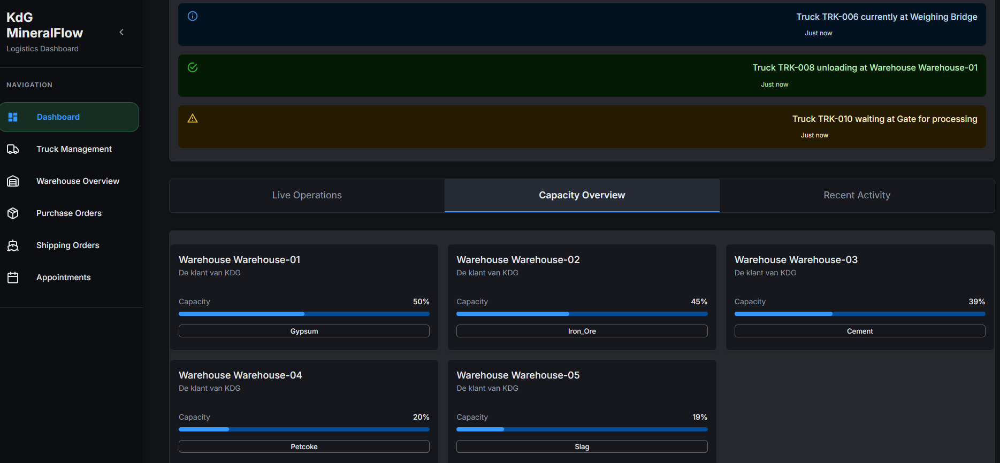
  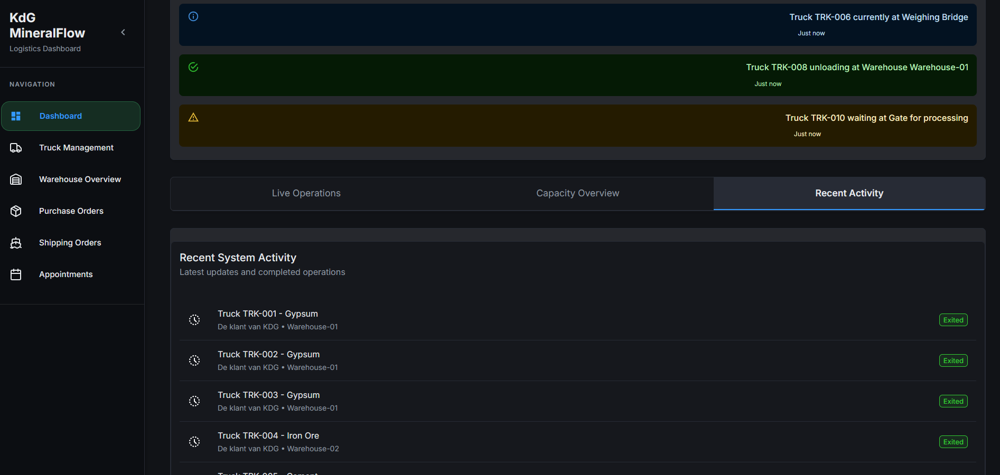
  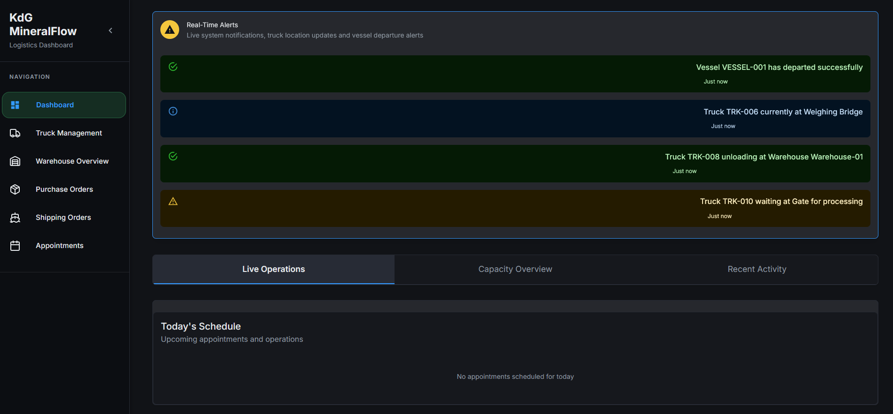
</p>

#### Truck Management
<p float="left">
  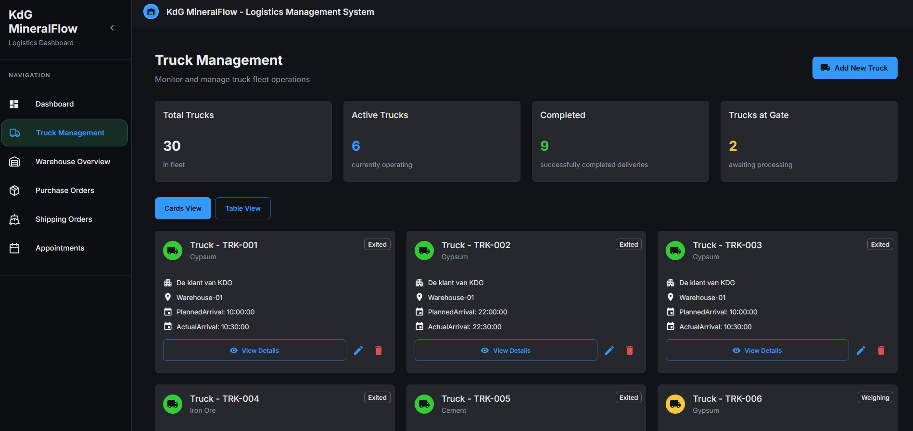
  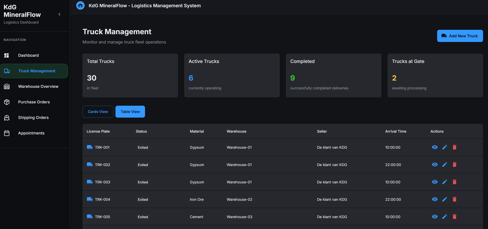
  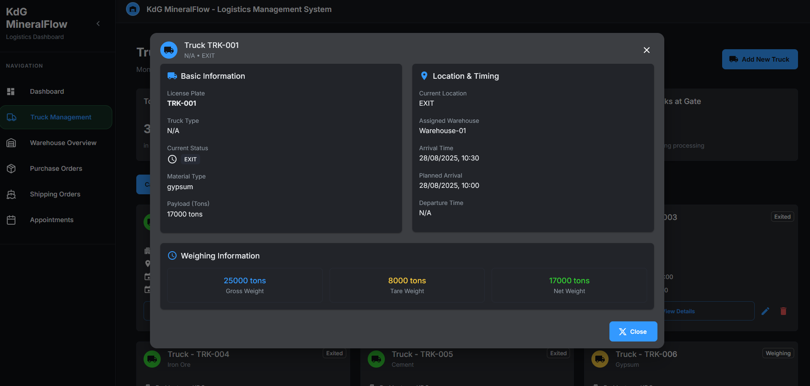
</p>

#### Warehouse Overview
<p float="left">
    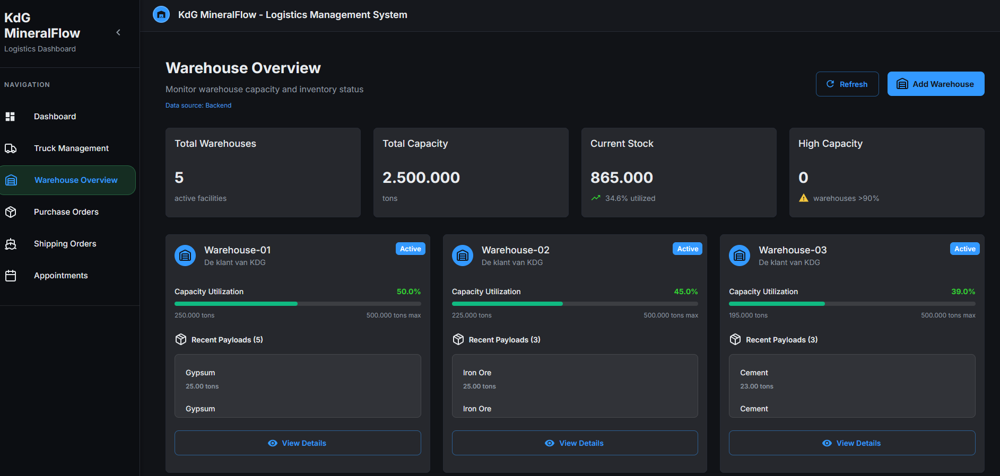
    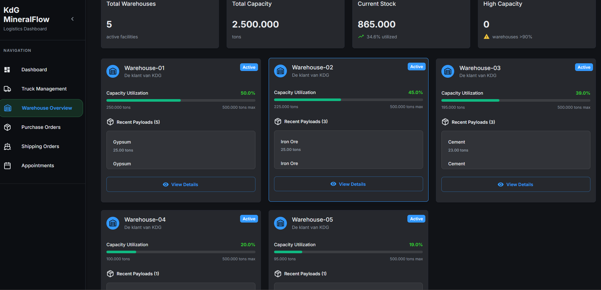
    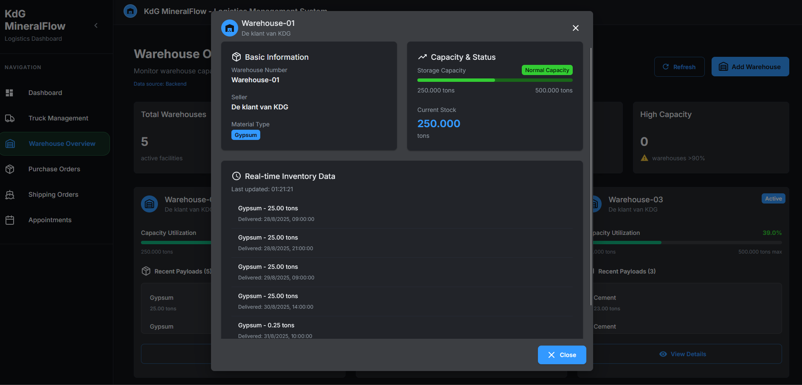
</p>

#### Purchase Orders
<p float="left">
    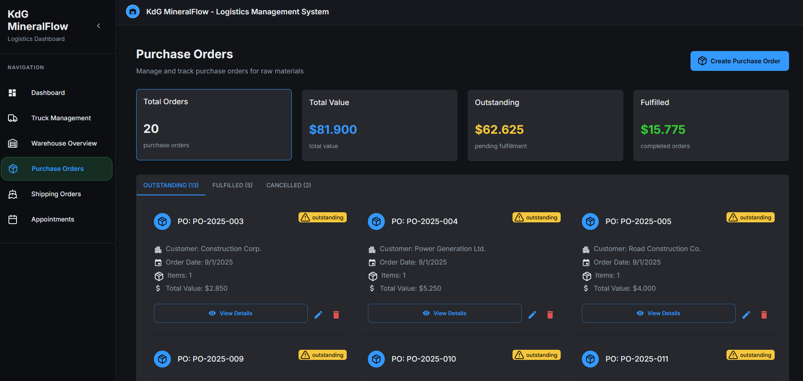
    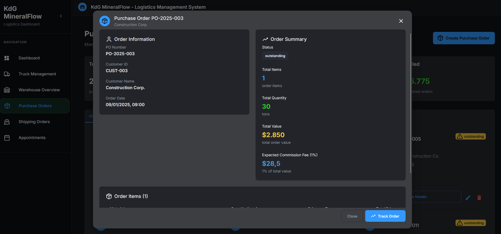
    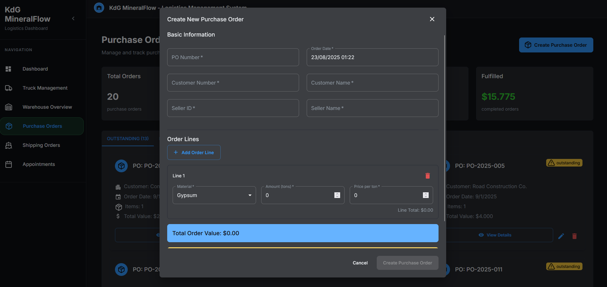
</p>

#### Shipping Orders
<p float="left">
    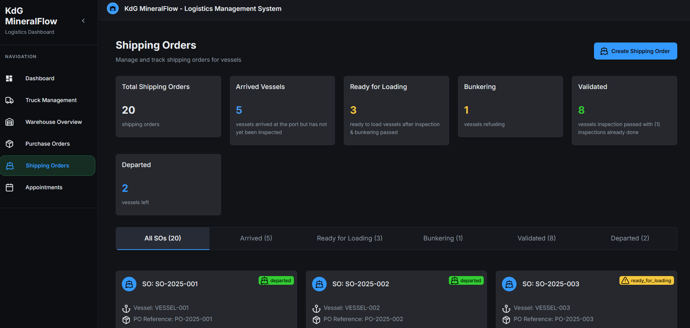
    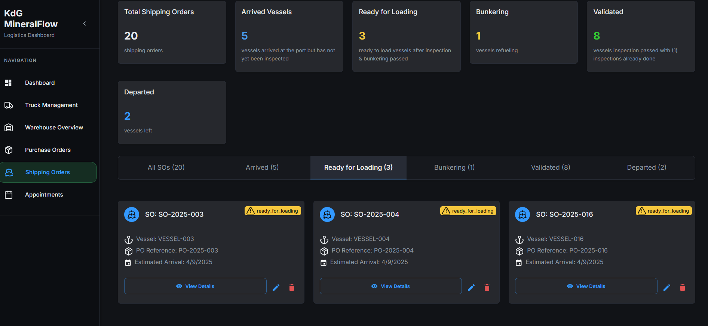
    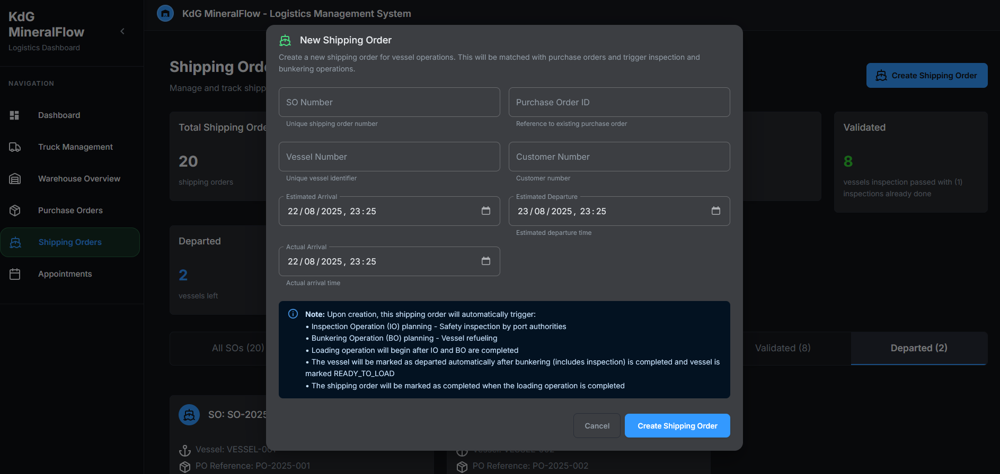
</p>

#### Appointments
<p float="left">
  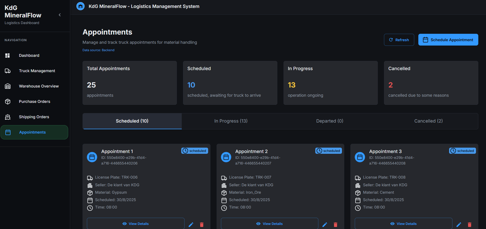
  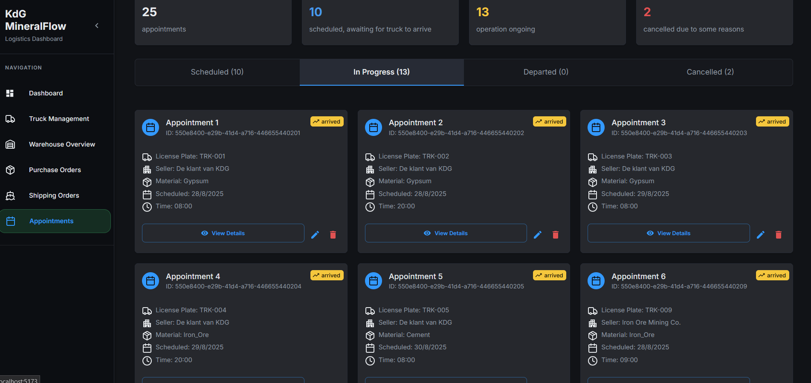
  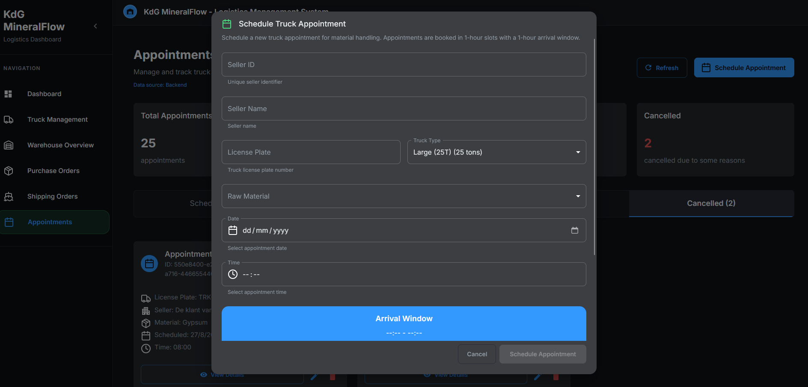
</p>


## 🛠️ Tech Stack

### Frontend Framework

- **React 18.3.1** - Modern React with hooks and functional components
- **TypeScript 5.6.2** - Type-safe JavaScript development
- **Vite 5.4.10** - Fast build tool and development server

### UI Components & Styling

- **Material-UI (MUI) 6.1.7** - Comprehensive component library
- **Emotion** - CSS-in-JS styling solution
- **Lucide React** - Beautiful, customizable icons

### State Management & Data Fetching

- **React Query (TanStack Query) 5.59.16** - Server state management
- **React Router DOM 6.27.0** - Client-side routing
- **Axios 1.7.7** - HTTP client for API communication

### Development Tools

- **ESLint 9.13.0** - Code linting and quality enforcement
- **TypeScript ESLint** - TypeScript-specific linting rules
- **JSON Server** - Mock backend for development and testing

## 📁 Project Structure

```
src/
├── components/          # Reusable UI components
│   ├── dialogs/        # Modal dialogs for CRUD operations
│   ├── ui/            # Base UI components
│   ├── AppSidebar.tsx # Main navigation sidebar
│   ├── RoleGuard.tsx  # Role-based access control
│   └── RouteGuard.tsx # Route protection
├── context/            # React context providers
│   ├── SecurityContext.tsx      # Authentication context
│   └── SecurityContextProvider.tsx
├── hooks/              # Custom React hooks
│   ├── useAppointmentsData.ts
│   ├── useDashboardData.ts
│   ├── usePurchaseOrderData.ts
│   ├── useShippingOrderData.ts
│   ├── useTruckData.ts
│   └── useWarehouseData.ts
├── lib/                # Utility libraries and constants
├── pages/              # Main application pages
├── services/           # API services and authentication
├── theme/              # Material-UI theme configuration
├── types/              # TypeScript type definitions
└── utils/              # Helper functions and utilities
```

## 🚀 Getting Started

### Prerequisites

- Node.js (version 18 or higher)
- npm or yarn package manager

### Installation

1. **Clone the repository**
   ```bash
   git clone <https://github.com/HopeyCodeDS/frontend.git>
   cd frontend
   ```

2. **Install dependencies**
   ```bash
   npm install
   ```

3. **Start development server**
   ```bash
   npm run dev
   ```

4. **Start mock backend (optional)**
   ```bash
   npm run backend-mock
   ```

The application will be available at `http://localhost:5173`

### Available Scripts

- `npm run dev` - Start development server with hot reload
- `npm run build` - Build for production
- `npm run preview` - Preview production build
- `npm run lint` - Run ESLint for code quality checks
- `npm run backend-mock` - Start mock backend server

## 🔐 Authentication & Authorization

The system implements role-based access control with the following features:

- **Security Context**: Centralized authentication state management
- **Route Guards**: Protected routes based on authentication status
- **Role Guards**: Component-level access control based on user roles
- **JWT Integration**: Secure token-based authentication

## 📊 Data Management

### React Query Integration

- Efficient server state management
- Automatic background refetching
- Optimistic updates
- Error handling and retry logic

### Custom Hooks

- `useWarehouseData` - Warehouse operations and data
- `useTruckData` - Truck management and tracking
- `usePurchaseOrderData` - Purchase order operations
- `useShippingOrderData` - Shipping order management
- `useAppointmentsData` - Appointment scheduling
- `useDashboardData` - Dashboard metrics and KPIs

## 🎨 UI/UX Features

### Material Design

- Consistent design language following Google's Material Design
- Responsive grid system for all screen sizes
- Dark/light theme support
- Accessible color schemes and typography

### Responsive Design

- Mobile-first approach
- Collapsible sidebar navigation
- Touch-friendly interface elements
- Adaptive layouts for different screen sizes

## 📝 Configuration

### Environment Variables

Create a `.env` file in the root directory:

```env
VITE_API_BASE_URL=your-api-base-url
VITE_KEYCLOAK_URL=your-keycloak-url
VITE_KEYCLOAK_REALM=your-realm
VITE_KEYCLOAK_CLIENT_ID=your-client-id
```

### Theme Customization

The Material-UI theme can be customized in `src/theme/theme.ts`:

- Color palette
- Typography scales
- Component default props
- Spacing and breakpoints

## 📝 License

This project is licensed under the MIT License.

---

**Built with ❤️ using React, TypeScript, and Material-UI**


